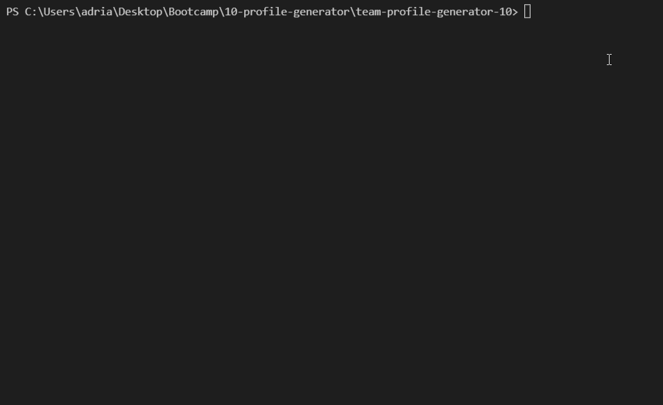
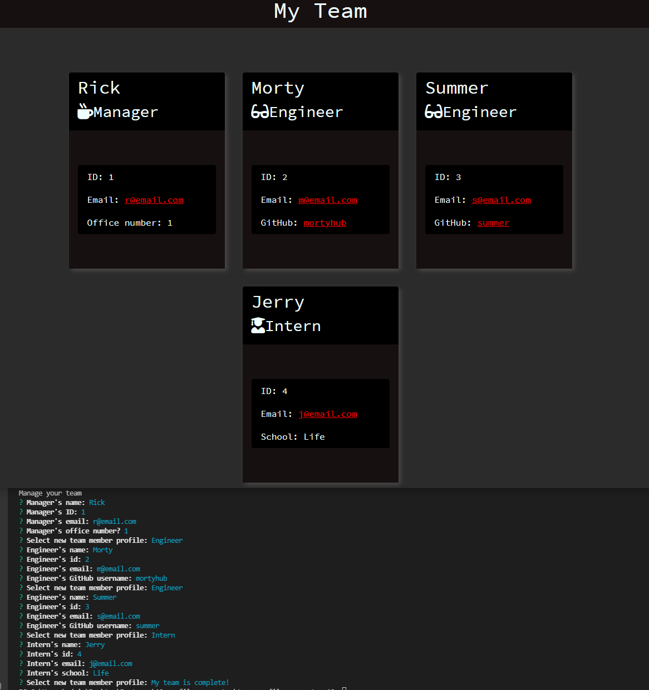
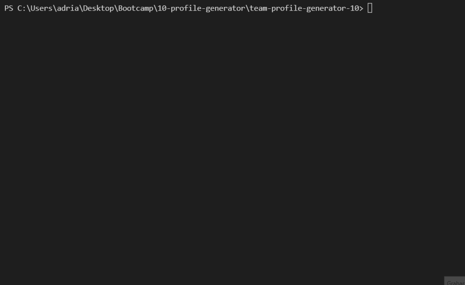

# team-profile-generator-10


Homework 10 - Team Profile Generator


## GitHub Repository 🚀

- [GitHub Repo Link](https://github.com/AdrianoArmen/team-profile-generator-10)

## Walkthrough Video 📺

- [Video Link](https://www.loom.com/share/03af87a8811f43a5b04072d99d5c08fb)

## Project Description 📋

This command-line application powered by [Node.js](https://nodejs.org/es/) was built to showcase my understanding of Object-Oriented Programming and my experience with previously studied technologies like [NPM](https://www.npmjs.com/), the [File System module](https://nodejs.org/api/fs.html), and the [Inquirer package](https://www.npmjs.com/package/inquirer). This application will allow you to generate an HTML file with all your development team information. A series of questions will be prompted on the command line to fit your needs. A series of tests were built using [Jest](https://jestjs.io/docs/getting-started) to make sure the results given are expected. Finally, you will have a custom HTML file with custom style to display your team on a web browser.

**_Note_**: After running my app the **index.html** file generated on the example will be located on the output directory for example purposes. If you run the app with different team data that file will be overwritten. 


## Command-line App Functionality 🔧

- This example demonstrate the questions promped on the command line to build your team:





## Example Result 📦

- This ecample displays the generated HTML file on a live server with a custom team information:




## Run the App and Tests 💾

-  The application will be invoked by using the following command:

```bash
node index.js
```

-  The tests will run by using the following command:

```bash
npm test
```

- This example demonstrate the Jest tests run and passed on my console:




## Technologies used 🛠️

- [Node.js](https://nodejs.org/es/) - command-line enviroment
- [Inquirer.js](https://www.npmjs.com/package/inquirer) - inquiry session flow
- [File System module](https://nodejs.org/api/fs.html) - directory navigation
- [NPM](https://www.npmjs.com/) - package manager
- [Jest](https://jestjs.io/docs/getting-started) - javascript testing

## License 📄

This project is licensed under the MIT License - see the [LICENSE.md](LICENSE.md) file for details

---

© 2021 Adriano.

